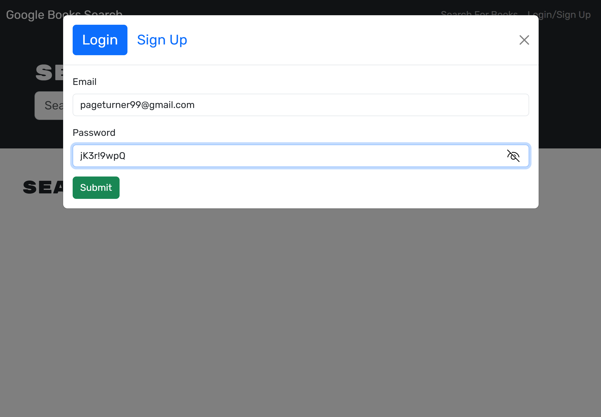

    <!-- PROJECT SHIELDS -->
    
    
    
    
    

 

<h3 align="center">:open_book: Google Books Search Engine</h3>

  

    Comprehensive platform to search for, save, and buy books
     
     
    <a href="https://github.com/sara-hines/google-books-search-engine"><strong>Explore the docs »</strong></a>
     
     
    <a href="#usage-and-features">View Features</a>
    ·
    <a href="https://github.com/sara-hines/google-books-search-engine/issues/new?labels=bug&template=bug-report---.md">Report a Bug</a>
    ·
    <a href="https://github.com/sara-hines/google-books-search-engine/issues/new?labels=enhancement&template=feature-request---.md">Request a Feature</a>
  

 
<!-- TABLE OF CONTENTS -->

  
Table of Contents

  <ol>
    <li>
      <a href="#description">Description</a>
      <ul>
        <li><a href="#built-with">Built With</a></li>
      </ul>
    </li>
    <li>
      <a href="#getting-started">Getting Started</a>
    </li>
    <li>
        <a href="#usage-and-features">Usage and Features</a>
        <ul>
            <li>
                <a href="#functionality-when-not-logged-in">Functionality When Not Logged In</a>
            </li>
            <li>
                <a href="#sign-up-and-login-functionality">Sign Up and Login Functionality</a>
                <ul>
                    <li><a href="#sign-up-functionality">Sign Up Functionality</a></li>
                    <li><a href="#login-functionality">Login Functionality</a></li>
                </ul>
            </li>
            <li>
                <a href="#features-when-logged-in">Features When Logged In</a>
                <ul>
                    <li><a href="#search-for-a-book">Search for a Book</a></li>
                    <li><a href="#purchase-a-book">Purchase a Book</a></li>
                    <li><a href="#see-additional-book-details">See Additional Book Details</a></li>
                    <li><a href="#save-a-book">Save a Book</a></li>
                    <li><a href="#view-and-delete-saved-books">View and Delete Saved Books</a></li>
                </ul>
            </li>
        </ul>
    </li>
    <li><a href="#contributing">Contributing</a></li>
    <li><a href="#license">License</a></li>
    <li><a href="#contact">Contact</a></li>
    <li><a href="#acknowledgments">Acknowledgments</a></li>
  </ol>

 

<!-- ABOUT THE PROJECT -->
## Description

This project is an intuitive Single Page Application (SPA) built with React and Apollo GraphQL which allows book lovers to search for, save, and buy books. It is supported by Google Books API, a resource relied on by sites and libraries from GoodReads to University of California Libraries. The result is an expansive, diverse selection of books. This SPA search engine provides secure signup, login, and authentication, allowing the user the personalized experience of saving books. The app acts as a single source to manage the user's book list—the selection of books is wide enough to satisfy even the most avid readers; the interactive UI tracks with the user's book list as it changes; and links to Google Pay allow the user to purchase books securely. The application is able to provide this dynamic, personalized experience, with the speed that users expect, due to the combination of React, React Router, Apollo GraphQL, and Mongoose.

React uses state to manage the appearance of the user interface. It intelligently updates and re-renders only the components of the UI that have changed, preventing unnecessary re-renders and optimizing speed. React Router handles navigation without needing full page reloads or excess network requests. Apollo and GraphQL work closely with React through useQuery and useMutation hooks—through these hooks, data can be fetched/updated quickly and smoothly. In a traditional REST API, multiple queries and network requests might be needed to fetch or update the exact data needed at any given time. GraphQL, on the other hand, helps this application to provide a fast, smooth experience by making more targeted, efficient queries and mutations. Mongoose/MongoDB make up the underlying database. With the flexibility of Mongoose/MongoDB, and the ability of GraphQL to integrate multiple database types, this API is very scalable. From a security standpoint, the app uses rigorous password validation, password hashing with bcrypt, and signed JSON Web Tokens for user authentication. On the whole, this application offers a streamlined, secure, smooth user experience for book enthusiasts looking to expand their collections. 

(<a href="#readme-top">back to top</a>)

### Built With

- [![Apollo-GraphQL][Apollo-GraphQL-badge]][Apollo-GraphQL-url]
- [![React][React.dev]][React-url]
- [![React-Router][React-Router-badge]][React-Router-url]
- [![Mongo][MongoDB]][Mongo-url]
- [![Mongoose][Mongoosejs]][Mongoose-url]
- [![Express][Express.js]][Express-url]
- [![Node][Node.js]][Node-url]
- [![Javascript][JavaScript]][Javascript-url]
- [![Nodemon][Nodemon.io]][Nodemon-url]

(<a href="#readme-top">back to top</a>)

<!-- GETTING STARTED -->
## Getting Started

No installation is needed in order to use this Google Books Search Engine. Simply navigate to the site at [INSERT LINK HERE] to start your book search. 

<!-- USAGE EXAMPLES -->
## Usage and Features

### Functionality When Not Logged In

When you arrive to the site, you will see the home page with a search bar and a prompt to search for a book to begin. A Login/Sign Up link will be visible in the top right corner of the navigation bar.

 

 

Without logging in, a user can enter a book title in the search bar, click the Submit Search button, and view book results. The search bar will be cleared of input on submission to prepare for the next input. For each book, the cover image, title, author(s), and description will be displayed, but no other options or links will be provided until the user is logged in.

To demonstrate, the below 3 screenshots show an example search for "The Secret History". 

 

 

(<a href="#readme-top">back to top</a>)

### Sign Up and Login Functionality

#### Sign Up Functionality

To sign up, first click the Login/Sign Up link. In the modal that appears, click "Sign Up" to switch from the Login form to the Sign Up form. A username, email, and password must be provided to create an account. In order to keep user data accurate and secure, there are specific requirements for these fields:
* usernames must be unique strings
* emails must be unique and in a valid email address format
* passwords must be at least 8 characters long and contain at least 1 lowercase letter, at least 1 uppercase letter, at least 1 digit, and at least 1 special character

The below screenshot shows a valid sign up form just before submission, with the password visible for demonstration purposes. 

 

 

When submitting the sign up form, if any of the fields don't meet the criteria, the account will not be created and an alert message, "Something went wrong with your signup!" will appear. The below 2 screenshots show an example of an invalid submission and the resulting alert.

 

 

#### Login Functionality

For returning users, only the account email and password need to be provided to log in. Continuing with the pageturner99's example account, the below screenshot shows a valid login form. 

 

 

If the user provides an incorrect email or password, the alert message "Something went wrong with your login credentials!" will appear, similar to the alert for an invalid signup form. 

Once the user is logged in, whether after a successful signup or a returning login, the user is redirected to the home page and the navigation links change to: Search For Books, See Your Books, and Logout.

(<a href="#readme-top">back to top</a>)

### Features When Logged In

#### Search for a Book

After submitting a search when logged in, the book results will each include a "Save this Book!" button. If the Google Books API entry for the book contained a link to purchase the book, a "Buy this Book!" button will appear (and will redirect the user to the link on click). If the API data didn't contain a link to purchase the book, but did include a link to see more details about the book, a "Show me More!" button will appear along with a "Sale link unavailable" message. If neither link was available, just the message "Sale link unavailable" will appear. Most searches return at least 1 matching record with a purchase link available, but this conditional rendering helps to provide value and clarity. 

The below screenshots show the first 3 search results for "The Animators" when logged in. 

 

 

#### Purchase a Book

After clicking the "Buy this Book" button from the second result, the user is redirected to the Google Play page to buy the book, as shown in the below screenshot. Google Pay handles the transaction with its multi-layer security infrastructure.

 

 

#### See Additional Book Details

For the first result for "The Animators," a purchase link was unavailable, but a link to see additional details was available. At this page (see screenshot below), there are options to preview the book or find the book from other providers.   

 

 

#### Save a Book

After clicking the "Save this Book!" button, the button will become read-only and display the text "Book already Saved!" as in the below GIF. This interactivity helps the user to keep track of what they have already saved while they continue to browse search results. 

 

 

#### View and Delete Saved Books

Then, after clicking "See Your Books" in the navigation bar, the Saved Books page will show the newly saved book. The same "Buy this Book!" and "Show me More!" options originally available will be conveniently accessible from the Saved Books page. 

As the user works through their book list, they can easily delete books using their respective delete buttons. This makes it easy for the user to track their purchases and reading list, adjusting as necessary. The below GIF displays a full book list and then demonstrates the delete book functionality.

 

 

When the user has finished updating their book list, clicking the Logout link in the navigation bar will remove their token and redirect them to the home page in a logged out state. The user's data is safely stored and accessible when the user logs in again.  

(<a href="#readme-top">back to top</a>)

<!-- CONTRIBUTING -->
## Contributing

Contributions are what make the open source community such an amazing place to learn, inspire, and create. Any contributions you make are **greatly appreciated**.

If you have a suggestion that would make this better, please fork the repo and create a pull request. You can also simply open an issue with the tag "enhancement".

Don't forget to give the project a star! Thanks again!

1. Fork the Project
2. Create your Feature Branch (`git checkout -b feature/AmazingFeature`)
3. Commit your Changes (`git commit -m 'Add some AmazingFeature'`)
4. Push to the Branch (`git push origin feature/AmazingFeature`)
5. Open a Pull Request

(<a href="#readme-top">back to top</a>)

<!-- LICENSE -->
## License

This project is covered under the MIT License. You can learn more about this license and its coverage and permissions [here](https://opensource.org/licenses/MIT).

(<a href="#readme-top">back to top</a>)

<!-- CONTACT -->
## Contact

If you have any questions/thoughts about this project or would like to connect, you can reach me at https://github.com/sara-hines/ or sara.marie.hines1@gmail.com. I look forward to hearing from you!

(<a href="#readme-top">back to top</a>)

<!-- ACKNOWLEDGMENTS -->
## Acknowledgments

I referenced documentation for Apollo and GraphQL and found the below sources helpful for implementing an input type. I also worked with Joem Casusi to troubleshoot Apollo Server errors and with Nick Sandoval to better understand context. Thank you to Joem and Nick for sharing their knowledge.   

Apollo GraphQL. (2024). GraphQL schema basics. Apollo Docs. https://www.apollographql.com/docs/apollo-server/schema/schema/#input-types

The GraphQL Foundation. (2024, April 24). Schemas and types. GraphQL. https://graphql.org/learn/schema/#input-types

This README was made from a modified template created by [@othneildrew](https://github.com/othneildrew). View the original [here](https://github.com/othneildrew/Best-README-Template).

(<a href="#readme-top">back to top</a>)

[Apollo-GraphQL-badge]: https://img.shields.io/badge/Apollo%20GraphQL-311C87?&style=for-the-badge&logo=Apollo%20GraphQL&logoColor=white
[Apollo-GraphQL-url]: https://www.apollographql.com/
[React.dev]: https://img.shields.io/badge/React-20232A?style=for-the-badge&logo=react&logoColor=61DAFB
[React-url]: https://react.dev/
[React-Router-badge]: https://img.shields.io/badge/React_Router-CA4245?style=for-the-badge&logo=react-router&logoColor=white
[React-Router-url]: https://reactrouter.com/en/main
[MongoDB]: https://img.shields.io/badge/MongoDB-%234ea94b.svg?style=for-the-badge&logo=mongodb&logoColor=white
[Mongo-url]: https://www.mongodb.com
[Mongoosejs]: https://img.shields.io/badge/Mongoose-880000?style=for-the-badge&logo=mongoose&logoColor=white
[Mongoose-url]: https://mongoosejs.com/
[Express.js]: https://img.shields.io/badge/express.js-%23404d59.svg?style=for-the-badge&logo=express&logoColor=%2361DAFB
[Express-url]: https://expressjs.com/
[Node.js]: https://img.shields.io/badge/node.js-6DA55F?style=for-the-badge&logo=node.js&logoColor=white
[Node-url]: https://nodejs.org
[JavaScript]: https://img.shields.io/badge/javascript-%23323330.svg?style=for-the-badge&logo=javascript&logoColor=%23F7DF1E
[Javascript-url]: https://ecma-international.org/publications-and-standards/standards/ecma-262/
[Nodemon.io]: https://img.shields.io/badge/NODEMON-%23323330.svg?style=for-the-badge&logo=nodemon&logoColor=%BBDEAD
[Nodemon-url]: https://nodemon.io/
